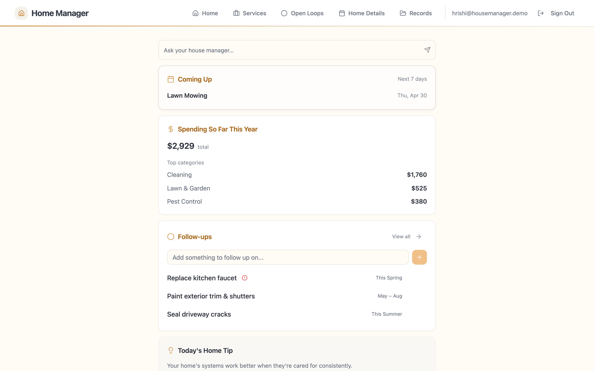
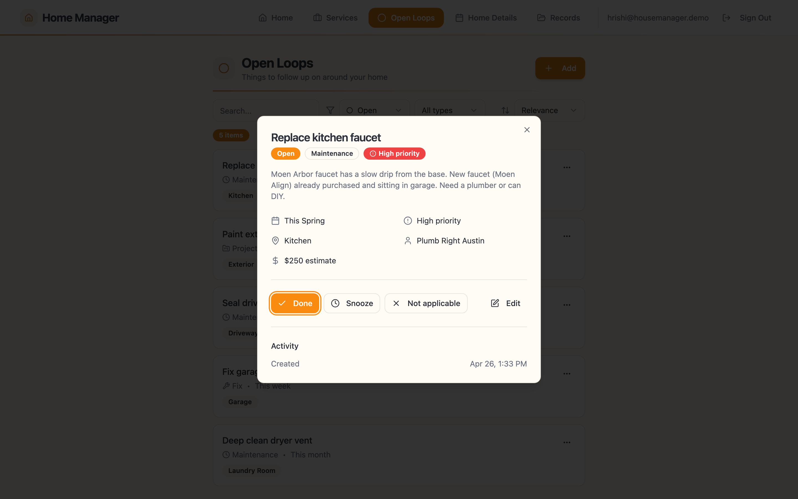
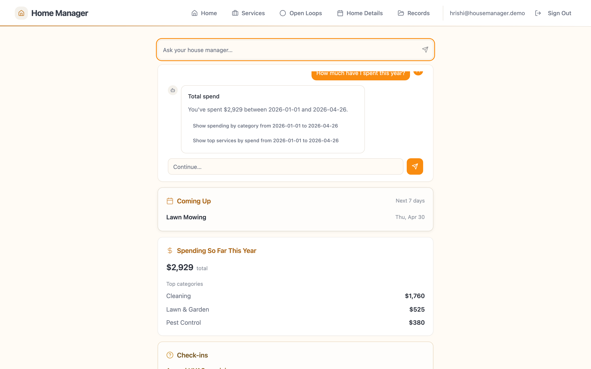

# 🏡 Home Manager

> A personal app I use daily to run my own household. Tracks recurring services, open items, receipts, and contracts — with an AI assistant that can answer questions because it's reading actual data, not guessing.

**Status:** Built for an audience of one (me). In daily use. Not productized.

---

## Why I built this

A house is a long list of small, half-finished things. Lawn every other Thursday. HVAC tune-up in spring. The faucet that's been dripping since April. The receipts for the last three plumbing visits are somewhere in email.

I tried four apps and three notebooks before building this. The pattern was the same: every one of them turned into a graveyard of stale checkboxes within a few months. The reason was structural — these apps store *tasks*, but they don't actually know anything about my house. Nothing knows that the company that came last Saturday is the same company that did the gutters in October, or that the replacement faucet is already sitting in the garage.

I wanted to see what would happen if the underlying data model was right *first*, and the AI assistant was layered on top of that.

## What it does

- Tracks **services** in a three-level hierarchy: Category (e.g. Cleaning) → Service (Spotless Home Services) → Visit (every visit, what was done, what was paid). So spend and frequency roll up from real history.
- Tracks **open items** — anything in the house that needs attention. Each one can be marked Done, Snoozed, or Not Applicable. The dashboard only shows what actually needs me this weekend.
- Stores **receipts and records**. Parses them automatically and links them to the right service or item.
- An **AI assistant** that has read everything above. I can ask *"how much have I spent on services this year?"* and it answers with a real number ($2,929 YTD), broken down by category. Or *"is the kitchen faucet still open?"* and it knows.

## Decisions I made — and why

**Built a real data model (Category → Service → Visit) before the UI.**
*Why:* A flat checklist captures what to do, not what you've already done. After three months it's just clutter. The hierarchy is what lets spending, frequency, and vendor history actually roll up — and it's what gives the AI assistant something real to answer from.

**"Open items" are their own thing, separate from tasks.**
*Why:* A house accumulates threads, not just to-dos. *Not applicable* and *snooze* are valid answers alongside *done* — because on any given Saturday the real question is "do I owe this thing my attention this weekend, yes or no."

**The AI chat is everywhere, but it isn't the entry point.**
*Why:* The dashboard leads. The chat sits below it. A chat is only useful if the system underneath it actually knows what you're talking about — otherwise it's just a fancy search box.

**The assistant only suggests follow-up questions it can actually answer.**
*Why:* A wrong suggestion is worse than no suggestion. Each follow-up is a small promise. The assistant only proposes ones it has the data to answer.

**Merged vendors, contracts, and contacts into one thing: Services.**
*Why:* Early on these were separate. Merging them made the assistant dramatically more reliable, because there was one less thing it could get confused about. Also: no gamification, no streaks, no social — the reward is the faucet eventually gets fixed.

## How it's built

- **Frontend:** React 18 + Vite + TypeScript, shadcn/ui, Tailwind, TanStack Query, react-hook-form + Zod
- **Backend:** Supabase (Postgres + Auth + Storage) with Edge Functions in Deno
- **AI:** OpenAI `gpt-4o-mini` for parsing and routing, `gpt-4o` for harder reasoning
- **Notable:** The assistant doesn't just chat — it routes each question through a small pipeline of functions (one parses the question, one runs it against the data, one writes the response). That way the answers are grounded in real records rather than made up.

## What I learned

Most consumer AI products lose by making the chat *the* product. Without a real data model underneath, the assistant has nothing to remember and every question starts from scratch. The structure underneath and the assistant on top have to be designed together — the structure constrains what the assistant can say with confidence, and the assistant makes the structure useful by letting you ask things you couldn't ask before.

---

*Source code is private. Available on request — reach out via LinkedIn.*
