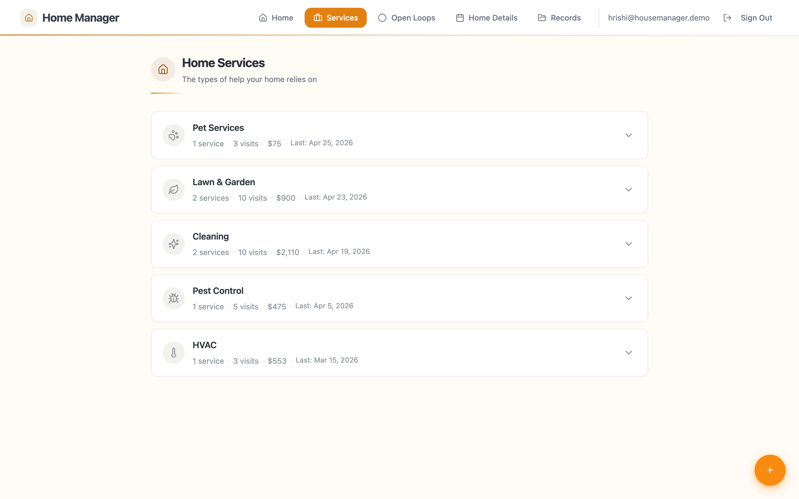
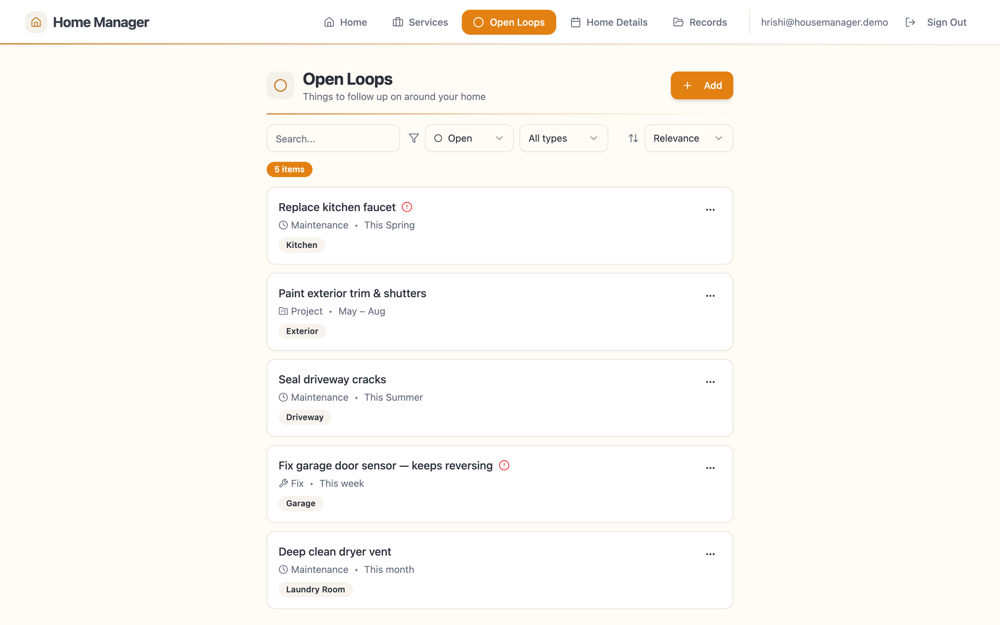

<!-- TAGLINE -->

A web app I built to run my own house. It tracks vendors, recurring services, and the stuff I keep forgetting to fix.

<!-- BLURB -->

A web app I built for myself to manage my house. It keeps track of vendors I've used, services that come around every few months (HVAC, lawn, gutters), money I've spent, and the small repairs I keep putting off. There's a chat box at the top of the dashboard that's read everything in the app, so I can ask "how much have I spent on cleaning this year?" and get a real answer instead of a guess. I built it because I tried four apps and three notebooks and none of them remembered enough about my house to actually be useful.

<!-- FULL README BELOW -->

# House Manager

A web app I built to run my own house. It tracks vendors, recurring services, and the stuff I keep forgetting to fix.

**Status:** In daily personal use. One user (me). Not deployed publicly.

## Why I built this

I own a house. A house generates a constant trickle of small decisions — when was the HVAC last serviced, who did the gutters last fall, did I ever buy that replacement faucet (yes, it's in the garage, it's been there since April).

I tried four apps and three notebooks before building this. They all failed the same way. They were fine at capturing a to-do. They were bad at remembering anything about my house. Nothing knew that "Spotless Home Services" was the same vendor that came last Saturday. Nothing knew gutter cleaning is a seasonal thing and not a one-off. Nothing could tell me how much I'd spent on cleaning this year.

So I built one. It's the smallest version I'd actually use.

## What it does

- Keeps a list of every recurring service (cleaning, HVAC, landscaping, pest control) with the vendor I use and every visit they've made
- Tracks "open loops" — the kitchen faucet, the garage door, the thing I keep meaning to call someone about — separately from to-dos, because most of these get snoozed or dropped, not finished
- Tells me how much I've spent on services this year, broken down by category
- Has a chat box on the dashboard that's read everything in the app and answers questions against my actual data (not made up)
- Pulls receipts and service documents into the same structure, so I can search them later
- Flags things I should pay attention to this weekend on the dashboard so I don't have to remember

*Categories at the top, individual services nested underneath. Last visit and cost come from the actual visit log.*

*Open loops are not to-dos. "Snooze" and "not applicable" are real outcomes.*

*The chat sits below the dashboard, not above it. Answers come from the actual data, with follow-up suggestions the app can actually run.*

## How I made it

**Built a proper data model (Category → Service → Visit) instead of a flat to-do list.**
A flat list of tasks turns into a graveyard after three months. The hierarchy is what makes "how much have I spent on cleaning this year" answerable at all.

**Made the chat secondary, not the front door.**
The dashboard is more useful when you open the app on a Saturday morning, so the chat sits below it. If you have a specific question, you scroll down and ask.

**Only suggest follow-up questions the app can actually answer.**
A bad suggestion is worse than no suggestion. The follow-up chips under the chat are limited to queries the app already knows how to run against the data.

**Skipped streaks, badges, and sharing.**
This is for a household, not a feed. The reward for using it is the faucet eventually gets fixed.

**Used OpenAI instead of running a smaller model myself.**
Cost decision, not a principled one. `gpt-4o-mini` is cheap enough that I don't think about it for a single-user app.

## How it's built

- **Frontend:** React, Vite, TypeScript, Tailwind, shadcn/ui
- **Backend:** Supabase (Postgres + Auth + Storage) with Edge Functions in TypeScript
- **AI:** OpenAI `gpt-4o-mini` for parsing and routing, `gpt-4o` for the chat answers
- **Hosting:** Supabase for the backend; runs locally for now

The chat doesn't shove the whole database into a prompt and hope. It runs a small pipeline: one function figures out what you're asking, another runs a real query against the data, a third writes the answer. That's why it can give a real dollar amount instead of inventing one.

## What I learned

The chat is only as good as the data underneath it. My first version had a clever chat and a sloppy schema, and the chat made things up constantly. I rebuilt with the data model first — Category, Service, Visit, Open Loop, Record — and the chat got dramatically more useful overnight without changing the model or the prompts. If you want an assistant to answer real questions about your stuff, the hard part is structuring your stuff, not the assistant.

---

*Source code is private. Available on request — reach out via LinkedIn.*
